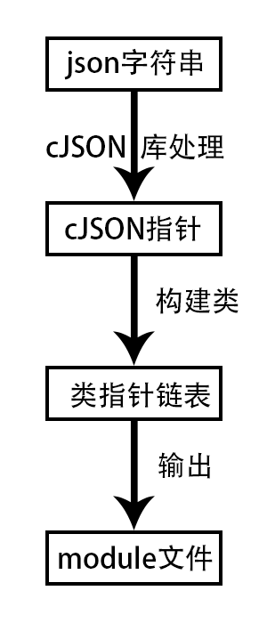

###简介
	一个把json文件，转换为java、objcetive-c的module文件。
	暂不支持一个array的下一级，还是array
	项目根目录下的java_head.txt，和objective-c_head.txt的内容会复制到生成的文件开始处

###实现逻辑大概是这样子的

###用到的第三方开源库
	cJSON c语言的json解析库

###编译
	命令行进入到项目根目录后
	make

	测试:
		make test
		测试生成的文件在项目目录下的out_file里面

###使用说明(English不是很好):
	json2moudle <json file path> [-n] [-o] [-p] [-h] [--java] [--objc]
	
	option:
	-n <module name> 	 	default is json file name
	-o <out path> 		 	default is run path
	-p <java pack name> 	default is ""
	-h 			 			help
	--java 			 		out java module file
	--objc 			 		out objective-c module file
	
	if not have --java or --objective-c, default is java
		
###使用事例：
	json2moudle t.json
	json2moudle t.json -n test2 -o ~/Desktop/test -p test.com.hehe
	json2moudle t.json -n test2 -o ~/Desktop/test
	json2moudle t.json -n test2 -o ~/Desktop/test -p test.com.hehe --objc --java

-----
##联系方式
* QQ：875766917，请备注
* Mail：875766917@qq.com

-----
##开源协议（License）
Apache-2.0
